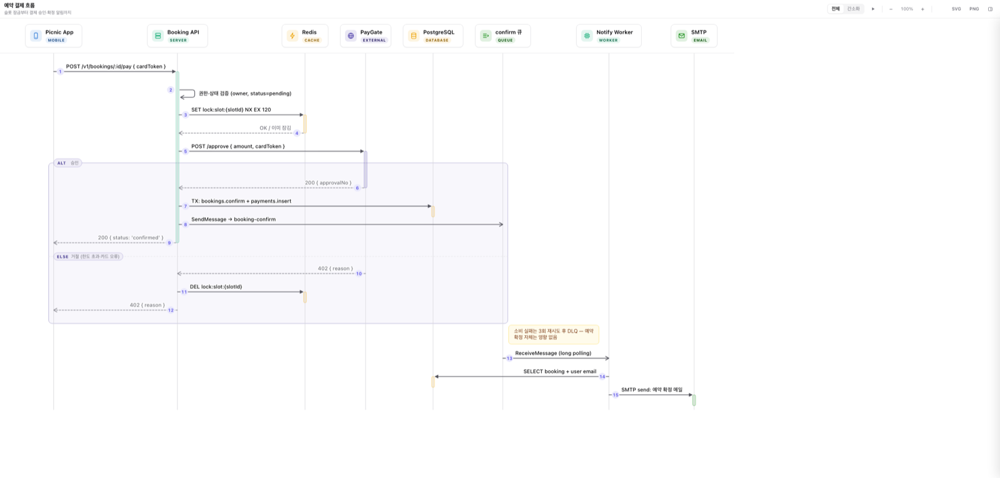
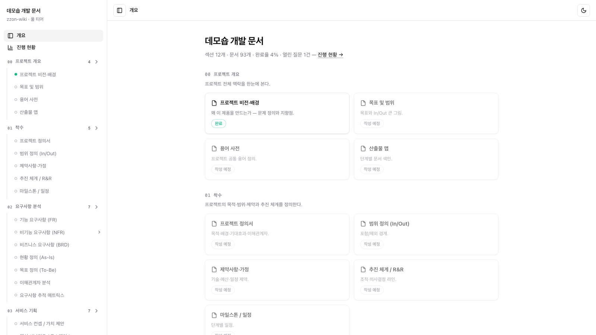

<p align="center">
  <a href="https://www.youtube.com/@김쫀떡">
    
  </a>
</p>

<h1 align="center">zzon-doc</h1>

<p align="center">
  A Claude Code plugin that analyzes your codebase and produces architecture diagrams, sequence diagrams, and a docs wiki.<br />
  Everything ships as a zero-dependency single <code>.html</code> — just open it in a browser.
</p>

<p align="center">
  <a href="https://docs.claude.com/en/docs/claude-code/plugins"></a>
  <a href="./LICENSE"></a>
  
</p>

<p align="center">
  <a href="./README.md">한국어</a> · <b>English</b>
</p>

## Introduction

**zzon-doc** adds four documentation skills to Claude Code. It reads your source, authors diagram specs and documents, and renders them as **self-contained single `.html` files** — no server, no libraries, no CDN.

| Skill | What it does |
|---|---|
| **zzon-doc** | Analyzes code and draws architecture diagrams — infra, data flow, ERD, agent topology |
| **zzon-seq** | Traces a feature's code path and draws actor-to-actor request/response over time |
| **terra-form** | Reads Terraform (`*.tf`) and draws cloud infrastructure with official AWS icons |
| **zzon-wiki** | Builds a project documentation wiki, filled by code scanning and interview-style questions |

## Preview

| Unified docs (menu + overview) | Sequence diagram (zzon-seq) |
|---|---|
|  |  |

Click a flow button and the path lights up with **step badges (①②③)**, a **step strip**, and a **right-side step panel**.


| ERD + detail sidebar (columns & FK links) | Documentation wiki (zzon-wiki) |
|---|---|
|  |  |

> All rendered from the bundled samples and examples — zero-dependency single `.html` files opened in a browser (labels are in Korean).

## Features

- **Five diagram kinds** — infra, data flow, sequence, ERD, and agent (`.claude`) topology, backed by a type catalog: context, multi-region HA, data pipeline, full-depth landscape, and more.
- **Zero-dependency output** — a self-contained single `.html` with no libraries or CDN.
- **Interactive viewer** — click nodes, highlight flows, step badges, drill-down (⊕ double-click), hover tooltips, pan/zoom, dark mode, and pure-vector SVG/PNG export.
- **Unified docs** — bundles many diagrams into one docs site with a left menu and an overview.
- **Sequence diagrams** — full/simplified toggle, per-step detail with source refs, step-through playback, and alt/opt/loop/par fragments.
- **Terraform infra** — AWS gets 838 official icons with an AZ×tier grid and span overlays; other clouds render as category cards with extension icons.
- **Docs wiki** — generates a wiki site that tracks progress and open questions; architecture pages embed the diagrams.
- **Scope-aware** — for large projects it surveys the structure first and proposes how many diagrams at which depth.
- **Local-only** — your code is analyzed locally, with zero network requests and zero telemetry.

## Getting Started

### Requirements

- Claude Code (a version with plugin/skill support)
- Node.js 20+ — runs the build scripts
- [bun](https://bun.sh) — runs the diagram engine. **Required for newly authored structure/infra diagrams and terra-form.** Without it, only legacy DiagramSpec JSON rendering, sequence diagrams, and the wiki keep working (automatic fallback)

### Installation

```
/plugin marketplace add HOKlNG/zzon-doc
/plugin install zzon-doc@zzon
```

Set up the diagram engine once:

```bash
cd zzon-doc/engine && bun install
```

## Usage

Call `/zzon-doc:zzon-doc <request>`, or just ask in natural language. (Plugin skills are namespaced as `plugin:skill`.)

**① Whole-project architecture** — surveys the structure first, **proposes what to draw and how many diagrams**, and once you agree, bundles them into a unified view (left menu + overview).

```
/zzon-doc:zzon-doc draw the architecture of this project
```

**② One specific part** — just that part, as a single diagram.

```
/zzon-doc:zzon-doc draw the cloud architecture of this repo
```

**③ Feature sequence diagram** — traces a feature's code path (route → service → queue → worker) into a time-axis sequence.

```
/zzon-doc:zzon-seq draw a sequence diagram of the checkout flow
```

**④ Terraform infra** — reads `*.tf` and draws the cloud infrastructure. AWS gets official icons and the AZ×tier grid; other clouds render as category cards.

```
/zzon-doc:terra-form ./infra
```

**⑤ Project documentation wiki** — agree on a tier (lite/standard/full SI) first; whatever is readable from code gets drafted automatically, and the rest is filled through questions. On re-runs it detects missing docs and human edits, and continues from there.

```
/zzon-doc:zzon-wiki build a docs wiki for this project
```

The generated `.html` is interactive: **click nodes, highlight flows, step badges, hover tooltips, pan/zoom, dark mode.**

### Output location

All output (specs, diagrams, wiki state) lands under **`docs/zzon-doc/`** in the target project. If a root-level `zzon-doc/` folder from an earlier version already exists, it keeps being used.

## Direct rendering (optional)

You can also render hand-written specs without the skills.

```bash
# a single .html
node zzon-doc/skills/zzon-doc/scripts/render.mjs <spec.json> [-o out.html]

# many specs -> unified docs (docs/zzon-doc/specs/*.json -> docs/zzon-doc/index.html)
node zzon-doc/skills/zzon-doc/scripts/build-docs.mjs ./docs/zzon-doc --title "My architecture docs"
```

The build scripts use only Node 20+ built-in modules. Structure diagrams are rendered by the built-in engine (bun); without bun it falls back to the legacy renderer **for legacy DiagramSpec JSON only**. Either way the output `.html` is self-contained with zero external requests.

## What's new

- **v0.8.2 — vocabulary policy, sequence catalog slots, flow label quality**: terra-form now covers cloud infrastructure in general (IaC-based). A legacy DiagramSpec can opt into the cloud icon vocabulary with a single `"vocabulary": "aws"` line (mixing is blocked by the validator), and the zzon-wiki catalog gained core-process sequence slots (seq-flows) so sequence diagrams come up automatically at the proposal stage. Dense-flow edge labels (corridor-width adaptive, pill rendering) and step-focus highlighting were improved.
- **v0.8.1 — unified diagram engine**: structure and data diagrams (infra/data-flow/erd/agent-topology) are rendered by a **built-in TS engine** — true auto-layout (ELK), orthogonal routing, and overlap/crossing invariants, while the viewer keeps the existing UX (sidebar, flows, legend, theme). Existing DiagramSpec JSON renders as-is through a built-in converter; the legacy renderer stays available via `ZZON_LEGACY_RENDER=1` or `"renderer": "legacy"` in the spec.

## About the name

`zzon-doc` is named after **Jjon-ddeok** (쫀떡), a cat I love — the one from the YouTube channel [김쫀떡 (Kim Jjon-ddeok)](https://www.youtube.com/@김쫀떡). The cat's name romanizes to *zzon-ddeok*; since this tool is all about **doc**umentation and diagrams, the name became a little pun: *zzon-ddeok → zzon-doc*. 🐱

## License

Licensed under the [MIT License](./LICENSE) — free to use, modify, and redistribute, **including commercial use**, as long as the copyright and license notice are kept.

## Acknowledgments

Icons are inlined as SVG from [Lucide](https://lucide.dev) (ISC), a fork of [Feather Icons](https://github.com/feathericons/feather) (MIT). See [`NOTICE`](./NOTICE) for full attribution.
