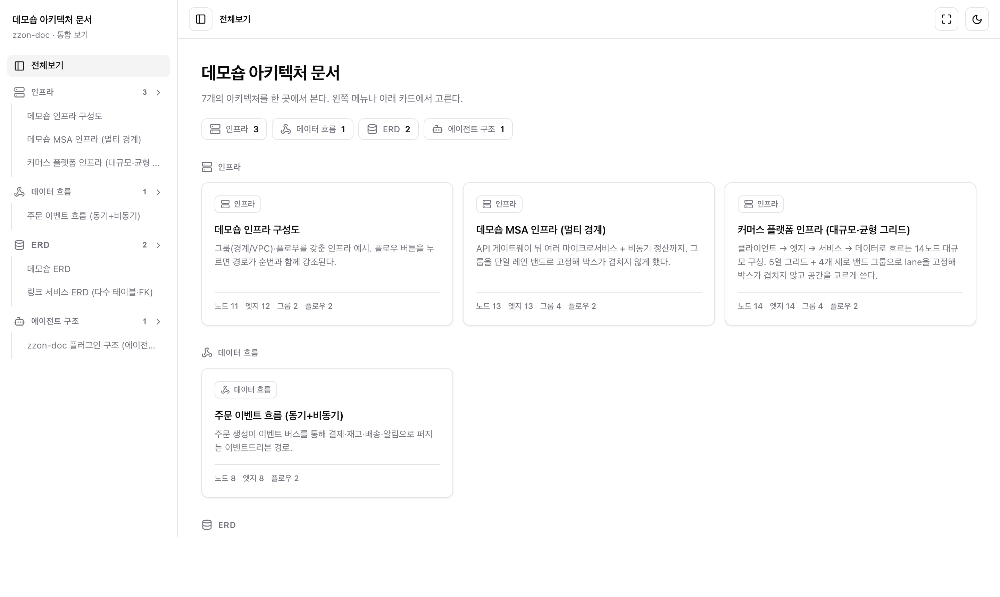
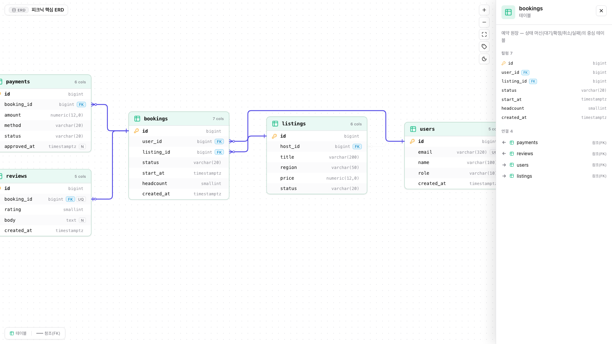
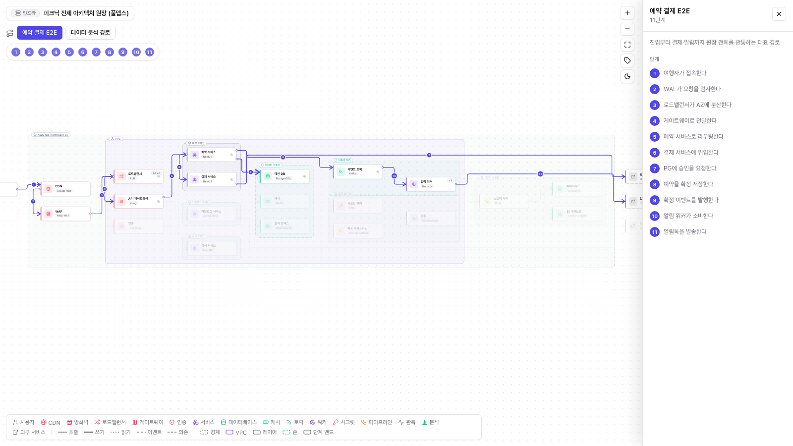

<p align="center">
  <a href="https://www.youtube.com/@김쫀떡">
    
  </a>
</p>

# zzon-doc — Claude Code 플러그인 마켓플레이스

[](https://docs.claude.com/en/docs/claude-code/plugins) [](./LICENSE) 

**한국어** · [English](./README.en.md)

> **Claude Code 플러그인(스킬)** — 코드베이스를 분석해 인터랙티브 아키텍처 다이어그램을 그린다. 결과물로 `.html`을 만들어 주고, 사용자는 브라우저로 열어서 보기만 하면 된다.

## 미리보기

| 통합 문서 (메뉴 + 전체보기) | 대형 ERD (FK 컬럼 앵커) |
|---|---|
|  |  |

**플로우 강조** — 플로우 버튼을 누르면 경로가 **순번 배지(①②③)**·**단계 패널**과 함께 강조된다.



> 번들 샘플로 만든 결과물.

## 특징

- **4종 다이어그램** — 인프라 · 데이터 흐름 · ERD · 에이전트(`.claude`) 구조
- **의존성 0** — 라이브러리·CDN 없이 self-contained 단일 `.html`
- **인터랙티브** — 노드 클릭 · 플로우 강조 · 순번 배지 · 호버 툴팁 · 팬/줌 · 다크모드
- **통합 문서** — 여러 장을 좌측 메뉴 + 전체보기로 묶음
- **범위 제안** — 큰 프로젝트는 구조를 파악해 "몇 장 그릴지" 먼저 제안한다
- **로컬 분석** — 코드는 로컬에서만 분석, 네트워크·텔레메트리 0

## 설치

```
/plugin marketplace add HOKlNG/zzon-doc
/plugin install zzon-doc@zzon
```

## 사용

`/zzon-doc:zzon-doc <요청>` 으로 부르거나 자연어로 요청하면 된다. (플러그인 스킬이라 호출은 `/zzon-doc:zzon-doc`, 자연어로도 자동 동작.)

**① 프로젝트 전체 아키텍처** — 구조를 먼저 파악해 **무엇을·몇 장으로 그릴지 제안**하고, 합의하면 여러 문서로 만들어 통합 뷰(좌측 메뉴 + 전체보기)로 묶는다.

```
/zzon-doc:zzon-doc 이 프로젝트의 아키텍처 그려줘
```

**② 특정 부분만** — 원하는 한 부분을 한 장으로.

```
/zzon-doc:zzon-doc 이 repo의 클라우드 아키텍처 그려줘
```

생성된 `.html`은 **노드 클릭 · 플로우 강조 · 순번 배지 클릭 · 호버 툴팁 · 팬/줌 · 다크모드**가 되는 인터랙티브 문서다.

## 직접 렌더링 (선택)

스킬 없이 손으로 만든 스펙도 렌더링할 수 있다.

```bash
# 단일 .html 한 장
node zzon-doc/skills/zzon-doc/scripts/render.mjs <spec.json> [-o out.html]

# 여러 스펙 → 통합 문서 (zzon-doc/specs/*.json → zzon-doc/index.html)
node zzon-doc/skills/zzon-doc/scripts/build-docs.mjs ./zzon-doc --title "문서 제목"
```

Node 20+ 내장 모듈만 쓴다. 설치할 의존성 없음.

## 요구사항

- Claude Code (플러그인/스킬 지원 버전)
- Node.js 20+ (`render.mjs` 실행용)

## [기타] 이름에 대하여

`zzon-doc`은 내가 좋아하는 고양이 **쫀떡(zzon-ddeok)**이의 이름에서 나왔다. 유튜브 채널 [김쫀떡](https://www.youtube.com/@김쫀떡)의 바로 그 쫀떡이다. 문서·다이어그램(**doc**)을 다루는 도구라, `zzon-ddeok`을 언어유희로 비틀어 **`zzon-doc`**으로 지었다. 🐱

## 라이선스

[MIT License](./LICENSE) — 상업적 사용 포함 **자유롭게 사용·수정·재배포**할 수 있다. 저작권·라이선스 고지만 유지하면 된다.

## 크레딧

아이콘은 [Lucide](https://lucide.dev)(ISC) — [Feather Icons](https://github.com/feathericons/feather)(MIT)에서 파생 — 를 SVG로 인라인해 쓴다. 자세한 고지는 [`NOTICE`](./NOTICE) 참고.
